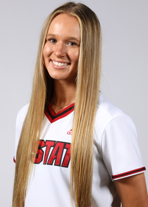
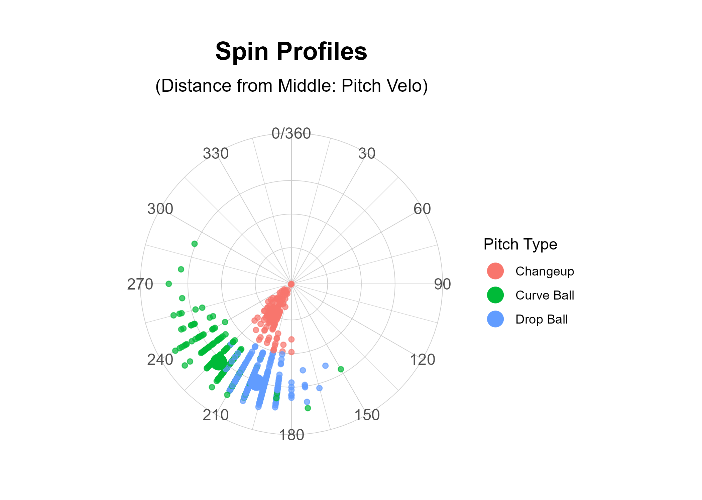

```{=html}
<!-- Google tag (gtag.js) -->
<script async src="https://www.googletagmanager.com/gtag/js?id=G-LMKQBFKL2F"></script>
<script>
  window.dataLayer = window.dataLayer || [];
  function gtag(){dataLayer.push(arguments);}
  gtag('js', new Date());

  gtag('config', 'G-LMKQBFKL2F');
</script>
    
<meta charset="utf-8" />
<meta name="generator" content="pandoc" />
<meta http-equiv="X-UA-Compatible" content="IE=EDGE" />

<style>
    
/* Style the top navigation bar */
.topnav {
  overflow: hidden;
}

/* Style the topnav links */
.topnav a {
  float: center;
  display: block;
  color: #333;
  text-align: center;
  padding: 14px 16px;
  text-decoration: none;
}

/* Change color on hover */
.topnav a:hover {
  background-color: #606060;
  color: white;
}

.center {
  display: block;
  margin-left: auto;
  margin-right: auto;
  width: 50%;
}

</style>

<body>

<div class="topnav">
      <a href="../analysis_report.html">Back</a>
    </div>
    
</body>
```


<style type="text/css">

h1 {
  font-size: 38px;
  text-align: center;
}
h1.title {
  display: none;
}
h2 {
  font-size: 28px;
  text-align: center;
}
h4.author {
  font-size: 18px;
  text-align: center;
}
</style>

```{r setup, include=FALSE}
knitr::opts_chunk$set(echo = FALSE, warning = FALSE, message = FALSE, fig.align = 'center')

library(tidyverse)
library(hrbrthemes)
library(gt)
library(gtExtras)
```

```{r read_data}
combined_data <- read_csv("~/Projects/tmking2002.github.io/projects/pitching_metric_analysis/combined_pitcher_data.csv") %>% 
  filter(Pitcher != "Autumn Pease") %>% 
  mutate(adj_SpinAxis = ifelse(adj_SpinAxis == 0, 360, adj_SpinAxis))
```

# Rylee Wyman

```{=html}

```


```{r wyman_data}
wyman <- combined_data %>% 
  filter(Pitcher == "Rylee Wyman" & HorzBreak < 10)
```

```{r wyman_pitch_breakdown}
wyman_pitch_metrics <- wyman %>% 
  drop_na(HorzBreak, SpinRate) %>% 
  group_by(PitchType) %>% 
  summarise(RelSpeed = mean(RelSpeed),
            HorzBreak = mean(HorzBreak),
            InducedVertBreak = mean(InducedVertBreak),
            SpinRate = mean(SpinRate),
            SpinAxis = mean(adj_SpinAxis),
            count = n()) %>% 
  ungroup()

wyman_pitch_metrics %>% 
  gt(rowname_col = "PitchType") %>% 
  cols_hide(count) %>% 
  tab_spanner(columns = c("HorzBreak", "InducedVertBreak"),
              label = "Induced Break") %>% 
  cols_label(HorzBreak = "Horizontal",
             InducedVertBreak = "Vertical",
             SpinRate = "Spin Rate (RPM)",
             SpinAxis = "Spin Axis") %>% 
  tab_header(title = "Pitch Breakdown") %>% 
  fmt_number(2:6, decimals = 1) %>% 
  gt_theme_guardian() %>% 
  tab_options(heading.align = 'center')
```

```{r wyman_break}
ggplot(wyman, aes(x = HorzBreak, y = InducedVertBreak)) +
  geom_point(aes(color = PitchType), alpha = .7) + 
  geom_point(data = wyman_pitch_metrics, aes(x = HorzBreak, y = InducedVertBreak, color = PitchType), size = 5) +
  xlim(-15,15) + 
  ylim(-15,15) + 
  theme_ipsum_es() +
  labs(title = "Induced Break",
       color = "Pitch Type",
       x = "Horizontal Break (In.)",
       y = "Induced Vertical Break (In.)") +
  theme(plot.title = element_text(hjust = 0.5, face = "bold"),
        plot.background = element_rect(fill = "#e5e5e5", color = "#e5e5e5"),
        panel.background = element_rect(fill = "#e5e5e5", color = "#e5e5e5"))
```

```{r wyman_spin}
plot <- ggplot(wyman %>% filter(PitchType %in% wyman_pitch_metrics$PitchType), aes(x = adj_SpinAxis, y = RelSpeed)) +
  geom_point(aes(color = PitchType), alpha = .7) + 
  geom_point(data = wyman_pitch_metrics, aes(x = SpinAxis, y = RelSpeed, color = PitchType), size = 5) +
  coord_polar() +
  scale_x_continuous(breaks = seq(0,360,30), lim = c(0,360)) +
  theme_ipsum_es() +
  labs(title = "Spin Profiles",
       subtitle = "(Distance from Middle: Pitch Velo)",
       color = "Pitch Type") +
  theme(plot.title = element_text(hjust = 0.5, face = "bold"),
        plot.subtitle = element_text(hjust = 0.5),
        axis.text.y = element_blank(),
        axis.title.x = element_blank(),
        axis.title.y = element_blank(),
        plot.background = element_rect(fill = "transparent", color = NA),
        panel.background = element_rect(fill = "transparent", color = NA))

ggsave("wyman_spin.png", plot, bg = "transparent")
```

```{=html}

```